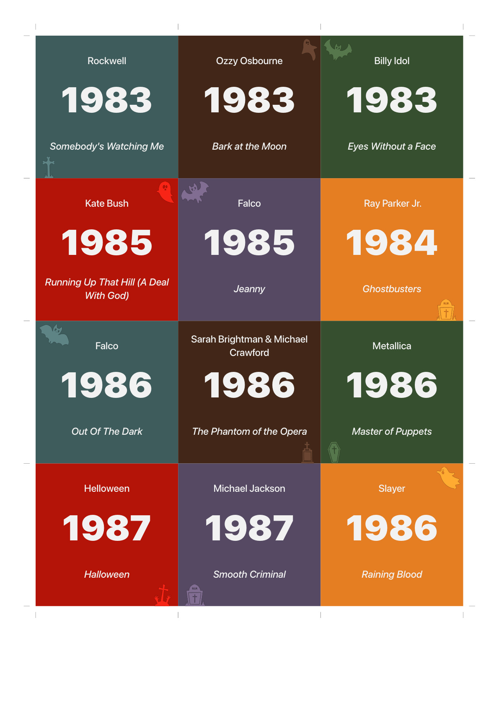

# 🎵 Hitster Card Generator

**Create your own printable [Hitster](https://hitstergame.com) cards from Spotify or Apple Music playlists!**

This is a modern DIY solution that generates professional-quality Hitster cards with QR codes, complete with a web app for scanning and playing audio previews.

<div align="center">

[](https://opensource.org/licenses/MIT)
[](https://www.python.org/downloads/)

</div>

## Example - Halloween Theme 👻

| Front | Back |
|-------|------|
|  |  |

## ✨ Features

- **🎵 Multi-Platform Support** — Works with both Spotify and Apple Music
- **📱 QR Code Scanner** — Scan cards at [hitster.scholl.tech](https://hitster.scholl.tech) and play audio previews instantly
- **🖨️ Print-Ready PDFs** — Professional duplex printing with cut marks
- **🎨 Themes** — Many themes for the printouts available
- **📊 Overview Generation** — Create year-based song overview to optimize the song distribution

## 🚀 Quick Start

### Prerequisites

- **Python 3.12+** with [Poetry](https://python-poetry.org/)
- Music service developer account (Spotify or Apple Music)

### Installation

```bash
# Clone the repository
git clone https://github.com/jonasscholl/hitster.git
cd hitster

# Install Python dependencies
poetry install
```

## ⚙️ Setup

### Spotify Setup

1. **Create Spotify App**
   - Visit [Spotify Developer Dashboard](https://developer.spotify.com/dashboard)
   - Create a new app and note your `Client ID` and `Client Secret`

2. **Configure Environment**
    - Copy the `.env.template` file and rename it to `.env`
    - Edit the file and provide these variables
        ```bash
        PROVIDER="spotify"
        CLIENT_ID="your_spotify_client_id"
        CLIENT_SECRET="your_spotify_client_secret"
        PLAYLIST_ID="your_playlist_id"
        ```

> **Disclaimer**: Spotify has deprecated preview URLs from their API and most songs don't have any preview URL. Currently the only reliable option is to just play the whole song from the beginning instead of a cutout (not optimal for the game). This is configurable via the `SPOTIFY_USE_PREVIEW_URL` environment variable.

### Apple Music Setup

1. **Get Apple Developer Credentials**
   - Join [Apple Developer Program](https://developer.apple.com/programs/) (active membership costs 99$ per year)
   - Create a MusicKit identifier and generate a private key with the MusicKit scope
   - Note your Team ID and Key ID

2. **Configure Environment**
   - Copy the `.env.template` file and rename it to `.env`
   - Edit the file and provide these variables
        ```bash
        PROVIDER="apple-music"
        APPLE_TEAM_ID="your_team_id"
        APPLE_KEY_ID="your_key_id"
        APPLE_PRIVATE_KEY_PATH="path/to/your/private_key.p8"
        PLAYLIST_ID="your_apple_music_playlist_id"

        # Optional: For private playlists
        APPLE_MUSIC_USER_TOKEN="your_user_token"
        ```

## 🎯 Usage

### Generate Cards

```bash
poetry run generate-hitster-cards
```

If you are using Visual Studio Code, you can also run the `Generate Hitster Cards` launch config.

This creates:
- `generated/hitster.pdf` — Printable cards
- `generated/overview.pdf` — Year-based song overview

### QR Code Scanner

Visit **[hitster.scholl.tech](https://hitster.scholl.tech)** to scan your generated QR codes and play audio previews directly in your browser.

### Printing

1. Open `generated/hitster.pdf`
2. Print duplex (double-sided) on cardstock
3. Cut along the provided marks
4. Start playing!

## 🎲 How to Play

1. **Scan** the QR code with your phone camera
2. **Listen** to the audio preview that plays
3. **Guess** the release year of the song
4. **Place** the card in chronological order on your timeline
5. **Win** by correctly placing the most cards!

These are the basic rules, for more information see the [official rules](https://hitstergame.com/en-gb/how-to-play-free/).

## 💡 Recommendation

To make the game enjoyable it makes sense to have a large range of years with evenly distributed songs. Since the main goal is to classify the songs by year, it makes the game harder the closer the release years are.

An overview diagram of the release year distribution is automatically created as `generated/overview.pdf` file.

## 🛠️ Configuration

### Environment Variables

| Variable | Required | Description |
|----------|----------|-------------|
| `PROVIDER` | ✅ | Music service: `spotify` or `apple-music` |
| `PLAYLIST_ID` | ✅ | Playlist identifier from your music service |
| `THEME` | Optional | Card theme: `black-white`, `colored`, or `halloween` (default: `black-white`) |
| `SPOTIFY_CLIENT_ID` | Spotify | Spotify app client ID |
| `SPOTIFY_CLIENT_SECRET` | Spotify | Spotify app client secret |
| `SPOTIFY_USE_PREVIEW_URL` | Spotify, Optional | Use preview URLs instead of full tracks |
| `APPLE_TEAM_ID` | Apple Music | Apple Developer Team ID |
| `APPLE_KEY_ID` | Apple Music | MusicKit key identifier |
| `APPLE_PRIVATE_KEY_PATH` | Apple Music | Path to your .p8 private key file |
| `APPLE_MUSIC_USER_TOKEN` | Apple Music | User token for private playlists |

### Song Overrides

You can override song data by creating an `overrides.json` file in the project root. This is useful for correcting incorrect metadata or customizing specific songs. You can take the (`generated/songs.json`) file as template, it has the same structure as the `override.json`.

**File Structure:**
```json
[
    {
        "id": "song_id_here",
        "year": 1964,
        "title": "Custom Title",
        "artists": ["Custom Artist"]
    }
]
```

**Available Fields:**
- `id` (required) — Song identifier to match against
- `year` — Override the release year
- `title` — Override the song title
- `artists` — Override the artist list
- `url` — Override the audio URL
- `source` — Override the music source

**Example:**
```json
[
    {
        "id": "400958931",
        "year": 1964
    },
    {
        "id": "1445667962",
        "title": "I Put a Spell On You (Remastered)",
        "year": 1965
    }
]
```

> **Note:** Only the `id` field is required. Any other fields provided will override the corresponding data from the music service.

## 🎨 Themes

Set the `THEME` environment variable to choose your card design:

| Theme | Description |
|-------|-------------|
| `black-white` | Clean black and white design (default) |
| `colored` | Vibrant colors with 5-color palette |
| `halloween` | Halloween theme with spooky graphics |

```bash
THEME="colored"  # Example usage
```

## 🤝 Contributing

Contributions are welcome! Please feel free to submit a Pull Request. For major changes, please open an issue first to discuss what you would like to change.

## 📄 License

This project is licensed under the MIT License - see the [LICENSE](LICENSE) file for details.

---

<div align="center">

**Enjoyed this project?** Give it a ⭐️ and share it with friends!

</div>
